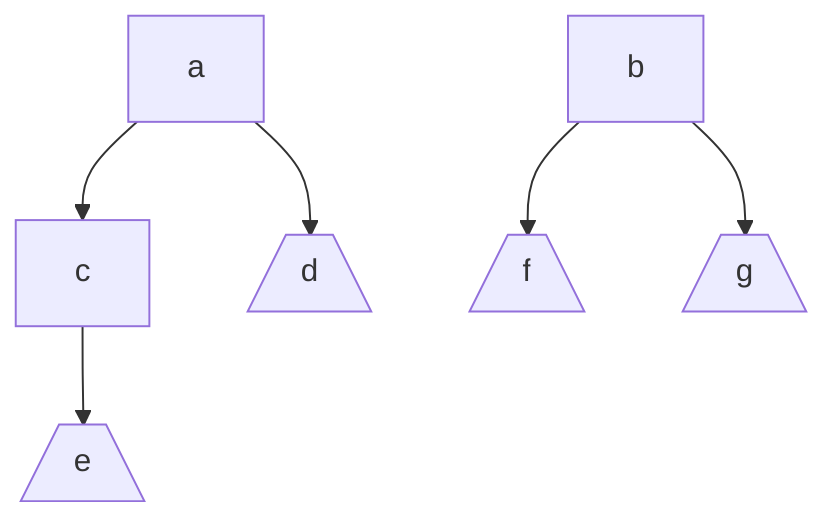
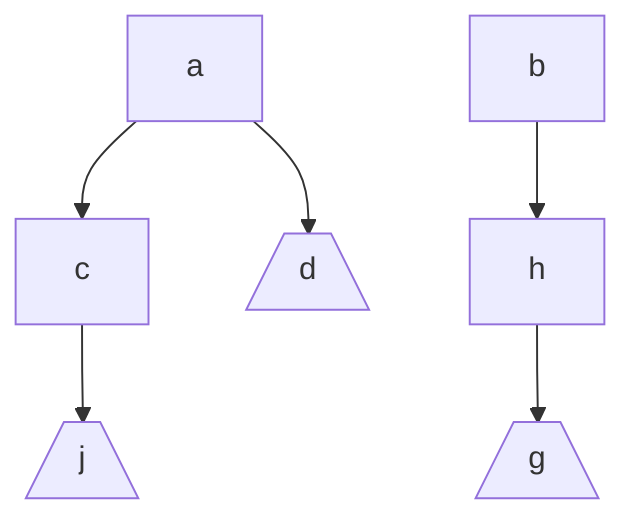
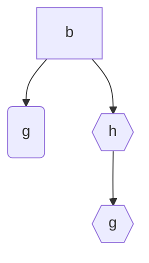
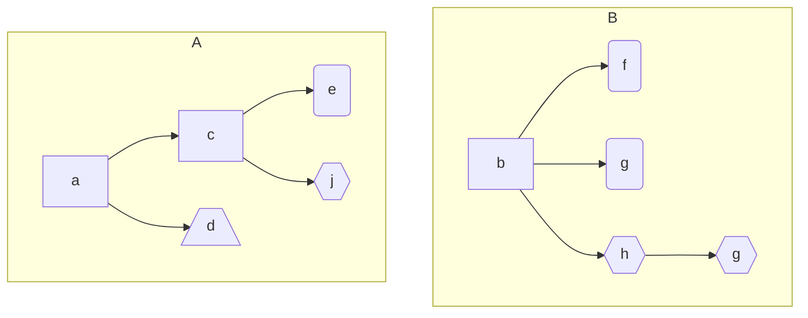

# New diff algorithm for case classes in Scala


Example, given a case class `Foo` with nested case classes...

```scala
case class Foo(a:A, b:B)

case class A(c:C d:D)
sealed trait EJ
case class E() extends Es
case class J() extends Es
case class D()
case class C(v:EJ)

case class B(f:Option[F], g:Option[G], h:Option[H])
case class F()
case class G()
case class H(g:G)

```


We can do two instances that want to compare:

```scala
val left = Foo(
 			a = A(
                c = C(E()),
                d = D()
            ), 
 			b = B(
     			f = Some(F()), 
     			g = Some(G()),
     			h = None)
    
val right = Foo(
 			a = A(
                c = C(J()),
                d = D()
            ), 
 			b = B(
     			f = None, 
     			g = None,
     			h = Some(G()))
```


These classes can be seen as Directed Acyclic Graphs (DAGs). Where the nodes are the names of the fields of the classes, e.g. `f`, `c`, etc. And the leaves are actual values, e.g. an int or case class that we want to treat as  leaf, e.g. `G()`, `E()`, or `J()`.

### Left



### Right



In the case of DAGs from classes, we only care about the leafs, since all the parents will be just the name of the field. Therefore each leaf can be identified by the path from the root, where each node is labeled with the name of the field from which it came.

| Left | Right |
| ---- | ----- |
| ace  | acj   |
| ad   | ad    |
| bf   | bhg   |
| bg   |       |

At this point I thought that it would be as simple as just compare the two lists, but how to know that two nodes should be compared to each other? 

### Needleman–Wunsch

While I was looking for several  algorithms for comparing graphs, I found this [Tree diffing](https://thume.ca/2017/06/17/tree-diffing) algorithm, which didn't adjust too well to my use case, but thanks to which I discovered the [Levenshtein distance](https://en.wikipedia.org/wiki/Levenshtein_distance) between two strings. And from there I arrived to the [Needleman–Wunsch algorithm](https://en.wikipedia.org/wiki/Needleman%E2%80%93Wunsch_algorithm), which is to find the "best match" for comparing two lists of different length. It was designed  to find similarities in the amino acid sequences of two proteins.

Needleman–Wunsch returns a set of tuples of two lists, 

e.g.: for `List(a,b,c)` and `List(ac)`  the best matches returned by the algorithm are:

```scala
Set(
  (List(a,b,c,-),List(a,-,c))
)
```

whereas for `List(a,b,c)` and `List(ca)` would be:

```scala
Set(
  (List(a,b,c,-),List(-,-,c,a))
  (List(-,a,b,c),List(c,a,-,-))
)
```

I decided to use it for finding the bests matches for two lists of leaves. I assumed that a change in a single node implies a entirely different leaf. For example `ace` is just a different leaf than `acj`. With that in mind, it can be helpful to think of each leaf with a distinct identifier.

| Identifier | Left | Identifier | Right |
| ---------- | ---- | ---------- | ----- |
| α          | ace  | ε          | acj   |
| β          | ad   | β          | ad    |
| λ          | bf   | ω          | bhg   |
| δ          | bg   |            |       |

The algorithm finds the best options for aligning two sequences, for example for the above graphs it would be:

```
αβλδ	αβλδ
εβ-ω	εβω-
```

Which would expand to:

| αβλδ | εβ-ω | αβλδ | εβω- |
| ---- | ---- | ---- | ---- |
| ace  | acj  | ace  | acj  |
| ad   | ad   | ad   | ad   |
| bf   | -    | bf   | bhg  |
| bg   | bhg  | bg   | -    |


### Mismatches

Now that all leaves are matched up. We need to find the actual difference between them. It's like zooming in: Now each leaf is a list of nodes, and they can have different lengths.

Therefore, for each leaf we use Needleman–Wunsch, for example, for `bg` and `bhg`, the algorithm would return:

```scala
Set(
	List(b,-,g),
    List(b,h,g)
   )
```

------

**Question**: *Is it true that all alignments for a node, will always have a single option?* 

**Answer**: *I don't know, but since the graphs are supposed to be very similar(what's the minimum of similarity? ) from the beginning,  the assumption is that the first elements of two leaves that where matched will be the same, and only later elements will mismatch. And that could be enough guarantee. :crossed_fingers:*

------

Now we can create a mismatch graph




From which we can construct the graphs of the mismatches:




