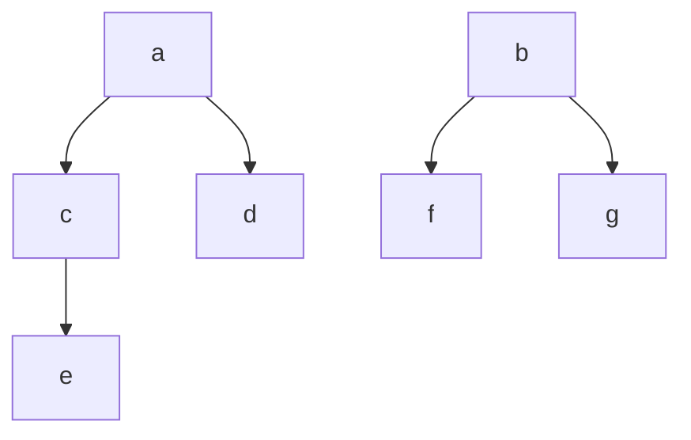
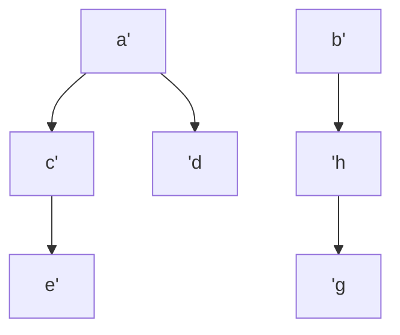
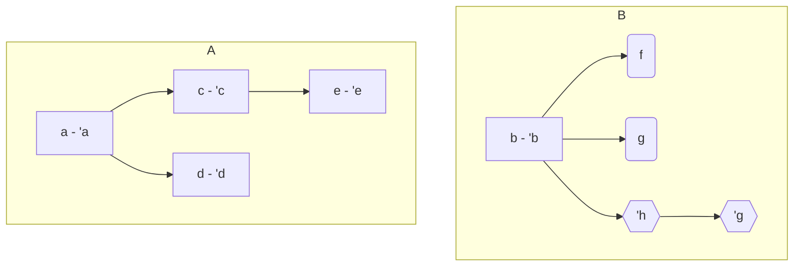

A case class is a DAG


```scala
case class E()
case class D()
case class C(e:E)
case class A(c:C d:D)
case class F()
case class G()
case class H(g:G)
case class B(f:Option[F], g:Option[G], h:Option[H])
case class Foo(a:A, b:B)
```


```scala
val left = Foo(
 			a = A(C(E())), 
 			b = B(
     			f = Some(F()), 
     			g = Some(G()),
     			h = None)
val right = Foo(
 			a = A(C(E())), 
 			b = B(
     			f = None, 
     			g = None,
     			h = Some(G()))
```


We need to compare two DAGs. They are mostly the same, starting with that assumption, we can try to list all its nodes, and compare the two lists to find the mismatches. Once the mismatches are found, we could construct a DAG with only the mismatches, since each node would contain information of its path.


### Left



### Right




| Name | Left nodes | Name | Right nodes |
| ---- | ---------- | ---- | ----------- |
| A    | ace        | E    | 'a'c'e      |
| B    | ad         | B    | 'a'd        |
| C    | bf         | F    | 'b'g'h      |
| D    | bg         |      |             |


Problem: how to adjust the two lists, if the lengths are different, and even if the lengths weren't different, how can we know their elements should be mapped one to one?

 While I was looking for several  algorithms for comparing graphs, I found this one https://thume.ca/2017/06/17/tree-diffing/, which didn't seem to adjust too well to my use case, but thanks to which I discovered the [Levenshtein distance](https://en.wikipedia.org/wiki/Levenshtein_distance) between two strings. And from there I arrived to the [Needleman–Wunsch algorithm](https://en.wikipedia.org/wiki/Needleman%E2%80%93Wunsch_algorithm), which is to find the "best match" for comparing two lists of different length. Which was designed  to find similarities in the amino acid sequences of two proteins.

The algorithm finds the best options for aligning two sequences, for example for the above graphs it would be:

```
ABCD	ABCD
EB-F	EBF-
```

Which would expand into:

| ABCD | EB-F   | ABCD | EBF-   |
| ---- | ------ | ---- | ------ |
| ace  | 'a'c'e | ace  | 'a'c'e |
| ad   | 'a'd   | ad   | 'a'd   |
| bf   | -      | bf   | 'b'g'h |
| bg   | 'b'g'h | bg   | -      |


From which we can construct the graphs:




