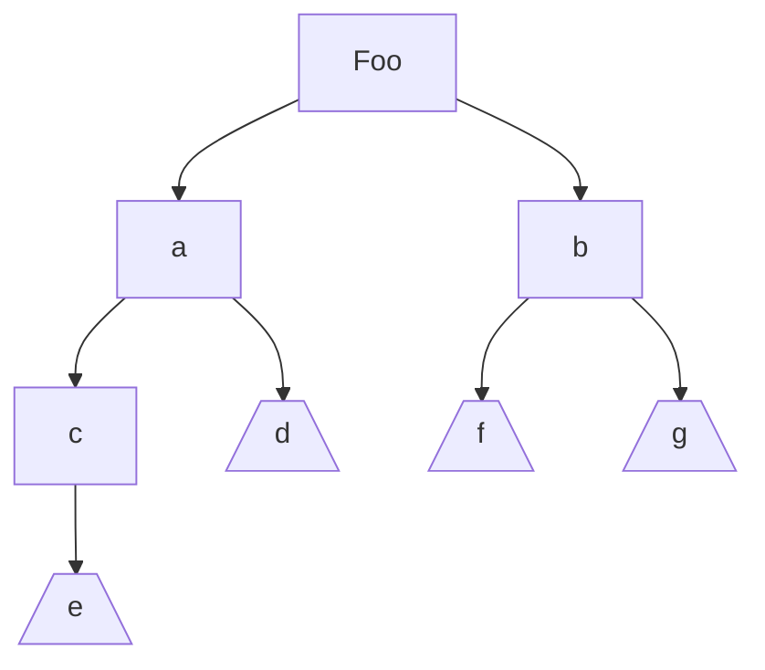
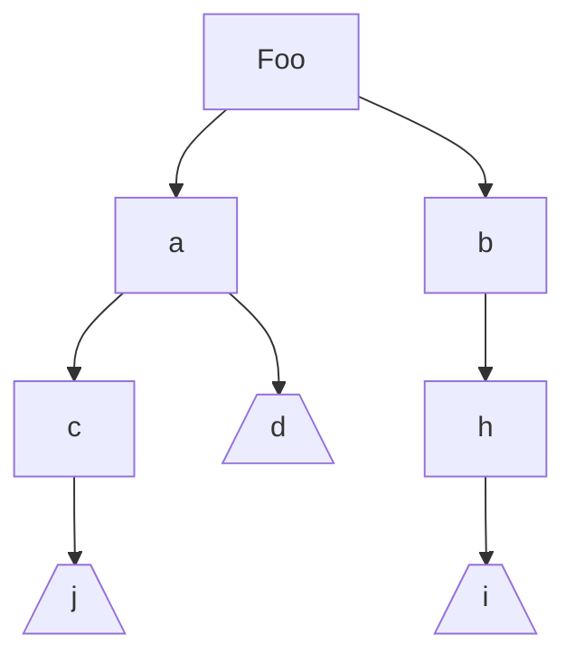
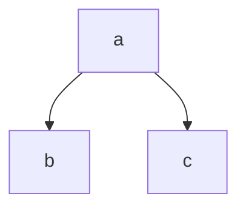
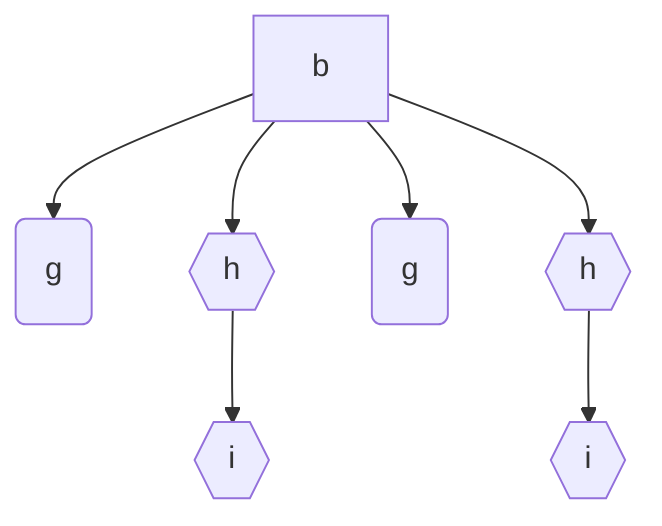
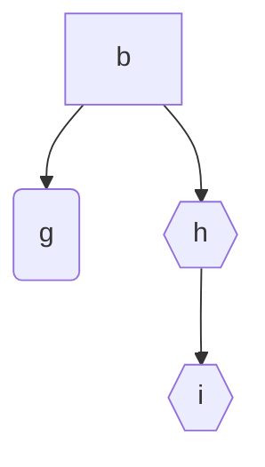
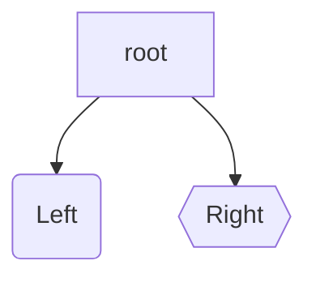
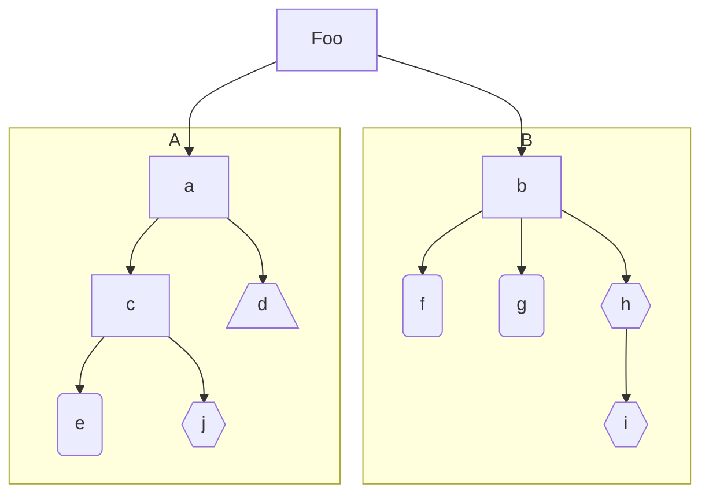

# New diff algorithm for case classes in Scala

## Example in Scala

Example, given a case class `Foo` with nested case classes...

```scala
case class Foo(a:A, b:B)

case class A(c:C d:D)
sealed trait EJ
case class E() extends Es
case class J() extends Es
case class D()
case class C(v:EJ)

case class B(f:Option[F], g:Option[G], h:Option[H])
case class F()
case class G()
case class I()
case class H(i:I)

```


For this example, these are the two instances that want to compare:

```scala
val left = Foo(
 			a = A(
                c = C(E()),
                d = D()
            ), 
 			b = B(
     			f = Some(F()), 
     			g = Some(G()),
     			h = None)
    
val right = Foo(
 			a = A(
                c = C(J()),
                d = D()
            ), 
 			b = B(
     			f = None, 
     			g = None,
     			h = Some(I()))
```


## Classes into Trees

These classes can be seen as Directed Acyclic Graphs (DAGs). Where the nodes are the names of the fields of the classes, e.g. `f`, `c`, etc. And the leaves are actual values, e.g. an int or case class that we want to treat as  leaf, e.g. `G()`, `E()`, or `J()`.

The graphs generated from classes will have the following properties:

- There are no disconnected subgraphs
- All edges are 1-to-many. 
-  There are no multiple edges between two nodes.

Which means that our DAGs are essentially trees.

### Left graph



### Right graph



### List of leaves

In the case of DAGs from classes, we only care about the leafs, since all the parents will be just the name of the field. Therefore each leaf can be identified by the path from the root, where each node is labeled with the name of the field from which it came.

| Left  | Right |
| ----- | ----- |
| a,c,e | a,c,j |
| a,d   | a,d   |
| b,f   | b,h,i |
| b,g   |       |

At this point I thought that it would be as simple as just compare the two lists, but how to know that two nodes should be compared to each other? 

## Graphs into matrices

Before finding a way to compare the leaves as list of nodes, we first need to find the leaves. The _how_ depends on the graph encoding we choose. After a few considerations, I figured to use an _Incidence Matrix_ encoding. Where each column is a node, and each row, an edge. 

For example, the following graph has 2 edges and 3 nodes.




Each row will only have two values: `-1` if the edge leaves the node corresponding to the column, and `1` if the edge is incoming.

| a    | b    | c    |
| ---- | ---- | ---- |
| -1   | 1    | 0    |
| -1   | 0    | 1    |

### The size of the matrix

Given a graph `G(N,E)`,  with the above restrictions, where:

​	`N`: number of nodes

​	`E`: number of edges

Then

if `N = 1`, then there cannot be any edges, i.e:  `G(1,0)`

if `N = 2` , then: `G(1,0) + G(1,0) = G(2,1)`, meaning that if there are two nodes, there most be one edge, and only one.

Subsequently, if `N = 3`:

Then there must be three subgraphs: `G(1,0)`,  `G(1,0)`, and `G(1,0)`, one for each node. 

And since all subgraphs need to be connected: `G(1,0) + G(1,0) + G(1,0) = G(2,1) + G(1,0) = G(3,2)`, since we need to add an edge every time two subgraphs are connected.

As a last example: `G(4, E) = G(2,1) + G(2,1) = G(4,3)`

In other words, for any new node, a new edge most be added. But there can be a single node without edges, therefore: `G(N,E) = G(N, N - 1)`

Which means that the column for the root node can be dropped, and the resulting matrix will be `N - 1 x N - 1`

The matrices for `right` and `left` are ( Notice the column for `Foo` is absent):

### Left matrix

| a    | b    | c    | d    | f    | g    | e    |
| ---- | ---- | ---- | ---- | ---- | ---- | ---- |
| 1    | 0    | 0    | 0    | 0    | 0    | 0    |
| 0    | 1    | 0    | 0    | 0    | 0    | 0    |
| -1   | 0    | 1    | 0    | 0    | 0    | 0    |
| -1   | 0    | 0    | 1    | 0    | 0    | 0    |
| 0    | -1   | 0    | 0    | 1    | 0    | 0    |
| 0    | -1   | 0    | 0    | 0    | 1    | 0    |
| 0    | 0    | -1   | 0    | 0    | 0    | 1    |

The leaves will be the columns which, when added all its rows, the result is > 0. The reason this work, is because this graphs are derived from classes, and thus it is not possible for a node to have two incoming edges. So at most any node will have a single `1`, if it has any number of negative values in the column, it will be impossible to have a sum > 0.

 

### Left leaves

| a    | b    | c    | d    | f    | g    | e    |
| ---- | ---- | ---- | ---- | ---- | ---- | ---- |
| -1   | -1   | 0    | 1    | 1    | 1    | 1    |

leaves = d, f, g, e

### Right matrix

| a    | b    | c    | d    | h    | i    | j    |
| ---- | ---- | ---- | ---- | ---- | ---- | ---- |
| 1    | 0    | 0    | 0    | 0    | 0    | 0    |
| 0    | 1    | 0    | 0    | 0    | 0    | 0    |
| -1   | 0    | 1    | 0    | 0    | 0    | 0    |
| -1   | 0    | 0    | 1    | 0    | 0    | 0    |
| 0    | -1   | 0    | 0    | 1    | 0    | 0    |
| 0    | 0    | -1   | 0    | 0    | 1    | 0    |
| 0    | 0    | 0    | 0    | -1   | 0    | 1    |


### Right leaves

| a    | b    | c    | d    | h    | j    | i    |
| ---- | ---- | ---- | ---- | ---- | ---- | ---- |
| -1   | 0    | 0    | 1    | 0    | 1    | 1    |

leaves = d, j, i

### Fully qualified leaves

Each label in the above matrices correspond to a _parameter name_ of a class. Two different classes could have parameters with the same name, therefore it is not safe to rely on the labels of the leaves. To identify a leaf, it will be better to take into account its full path from the root. In the graphs that we'll be dealing with, there will always be a single root node.

To find the full path of a leave, all we need to do is to traverse the matrix, for example, in the `Left graph`, to find the path of `e` the algorithm would  be the following:

1 - Find the row in which `e` has a `1`

2 - Search in that row for a `-1`, that is the next node, in this case it will be `c`

3 - Repeat until there are no more `-1`s

Final result: `e -> c -> a`

Thus, each leaf can be uniquely identified by its path.

## Needleman–Wunsch

While I was looking for several  algorithms for comparing graphs, I found this [Tree diffing](https://thume.ca/2017/06/17/tree-diffing) algorithm, which didn't adjust too well to my use case, but thanks to which I discovered the [Levenshtein distance](https://en.wikipedia.org/wiki/Levenshtein_distance) between two strings. And from there I arrived to the [Needleman–Wunsch algorithm](https://en.wikipedia.org/wiki/Needleman%E2%80%93Wunsch_algorithm), which is to find the "best match" for comparing two lists of different length. It was designed  to find similarities in the amino acid sequences of two proteins.

Needleman–Wunsch returns a set of tuples of two lists, 

e.g.: for `a,b,c` and `a,c`  the best matches returned by the algorithm are:

```scala
a,b,c
a,-,c
```

Whereas for `a,b,c` and `c,a` would be:

```scala
----------
Pairing 1
----------
a,b,c,-
-,-,c,a

----------
Pairing 2
----------
-,a,b,c
c,a,-,-
```

I decided to use it for finding the bests matches for two lists of leaves. I assumed that a change in a single node implies a entirely different leaf. For example `ace` is just a different leaf than `acj`. With that in mind, it can be helpful to think of each leaf with a distinct identifier.

| Identifier | Left  | Identifier | Right |
| ---------- | ----- | ---------- | ----- |
| α          | a,c,e | ε          | a,c,j |
| β          | a,d   | β          | a,d   |
| λ          | b,f   | ω          | b,h,i |
| δ          | b,g   |            |       |

The algorithm finds the best options for aligning the two sequences of leaves of `left` and `right` are: 

```
αβλδ	αβλδ
εβ-ω	εβω-
```

Which would expand to:

| αβλδ  | εβ-ω  | αβλδ  | εβω-  |
| ----- | ----- | ----- | ----- |
| a,c,e | a,c,j | a,c,e | a,c,j |
| a,d   | a,d   | a,d   | a,d   |
| b,f   | -     | b,f   | b,h,i |
| b,g   | b,h,i | b,g   | -     |


### Mismatches

Now that all leaves are matched up. We need to find the actual difference between them. It's like zooming in: Now each leaf is a list of nodes, and they can have different lengths.

Therefore, for each leaf we use Needleman–Wunsch, for example, for `b,g` and `b,h,i`, the algorithm would return:

```scala
----------
Pairing 1
----------
b,g,-
b,h,i

----------
Pairing 2
----------
b,-,g
b,h,i
```


### New DAGs from difference

For each pairing:

```python
pairing = (left_nodes, right_nodes)
for left, right in paring:
    if left == right:
        add_edge(previous, Same(left))
    else:
        add_edge(previous, Removed(left))
        add_edge(previous, Added(right))	
```


To create a new graph we can iterate over the two lists simultaneously, of the two elements are the same, they become a single node, otherwise the graph branches:


One intermediate step of the algorithm could be all the leaves duplicated:



But the actual construction of the graph should avoid duplicated edges.





To differentiate nodes and leaves from left we use round corners rectangles and for the right hexagons. Rectangles are common nodes/leaves:



From which we can construct the graphs of the mismatches:




